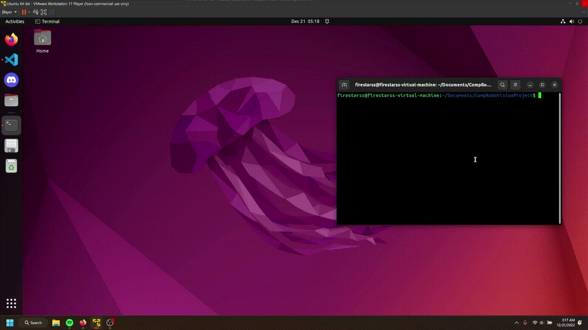
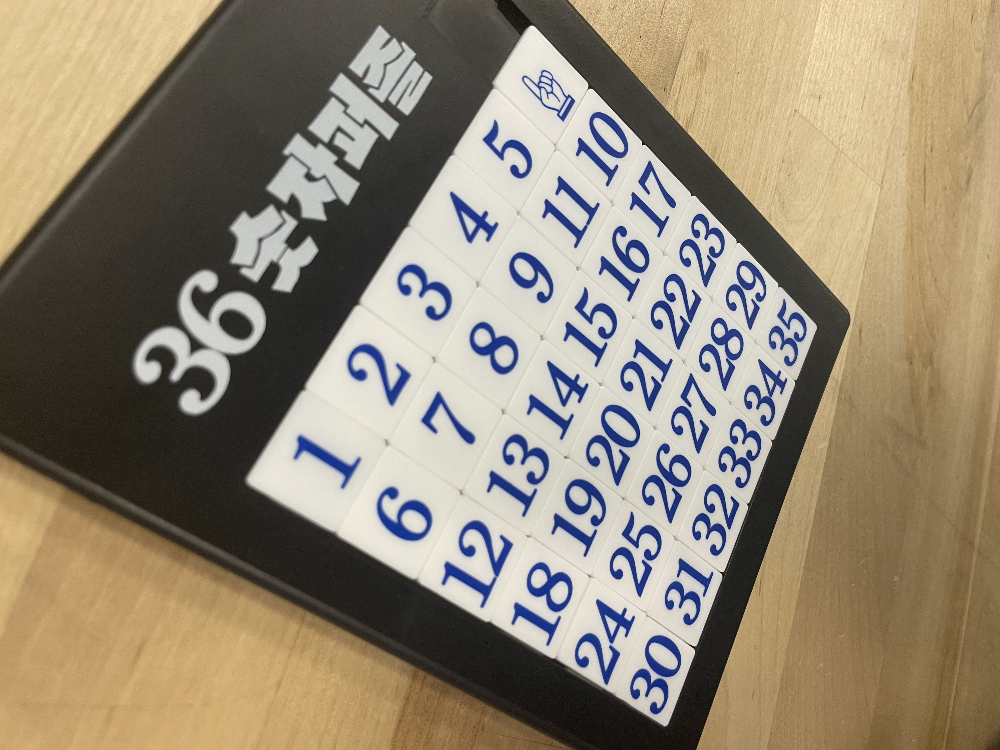
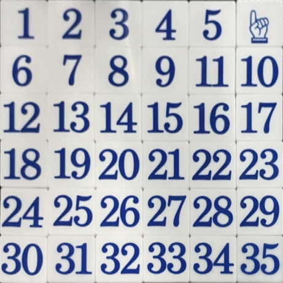
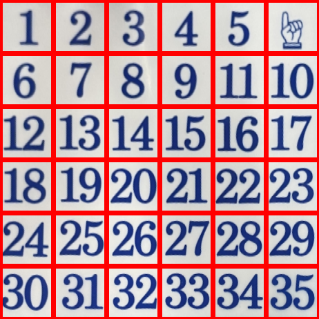
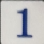
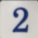
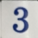
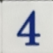
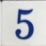
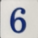

# CompRoboVisionProject

## Introduction

The goal of this project was to be able to take a picture of a slide puzzle and, using OpenCV and an OCR library, generate the current state of the puzzle. Below is a gif of the program running and successfully (kinda) recognizing the tiles.

## What is this program actually doing?

The program has 2 distinct parts to it:
1. Taking the base image and transforming it so that the puzzle area is cropped and directly head on to the camera.
2. Splitting the resulting image into individual tiles and extracting the text on them.

### Part 1: 4-Corner Transform

The first part is done through something called a 4-point transform. For that to work, you need to be able to either detect or select the 4 corners of the region of interest (ROI). In the above gif, you can see I am using my mouse to select the corners. From there, using built in methods in OpenCV, the code generates a transformation matrix that, once applied to the original image, takes it from something like this:

To this:

### Part 2: Slicing and OCR

Once you have the flattened image, you can split it evenly in to N segments. Since the slide puzzle I am using was a 6x6 puzzle, the image was segmented into 36 tiles all the same size. The segmenting looks something like this:

This generates 36 individual images that look like the following:

etc..

Each of these individual tiles are then pre-processed, and then run through Tesseract's OCR engine. This in turn, should tell us what the number on each tile is.

## Pitfalls

The largest pitfall of this project is that the OCR is really finicky and, even despite pre-processing, the result of the OCR is frequently that nothing was detected. For some reason it seems to detect the tiles in the 20-29 range significancy better than any of the other tiles. If I had more time I would love to see if I could make the OCR run smoother/more consistently either through tweaking some of it's parameters or doing further pre-processing on the input images.

One of the other pitfalls was more regarding the scope of the project. I initially wanted to have the corners for the 4-corner transform be automatically detected and not need human intervention. This was a large time-sink that yielded very minimal results. For the scope of the project, I decided that it would be easier to just have it be interactive and make the user define the edges of the puzzle.

## Conclusion

Overall I am very happy with how this project turned out. If I had more time I would love to continue working with the OCR engine and potentially also work on getting the automatic corner detection working. I also would love to implement some sort of graph-search algorithm in order to take the state that this program would ideally yield and find a path to solve the puzzle.